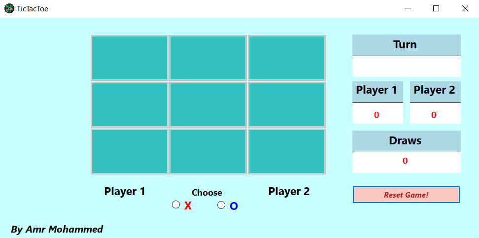
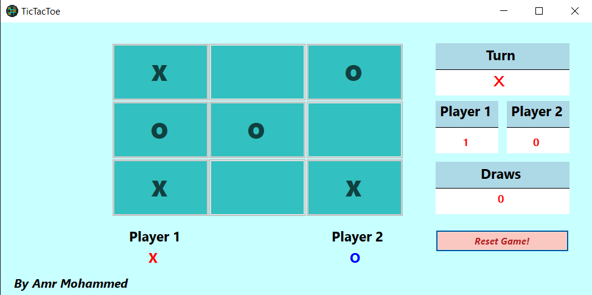
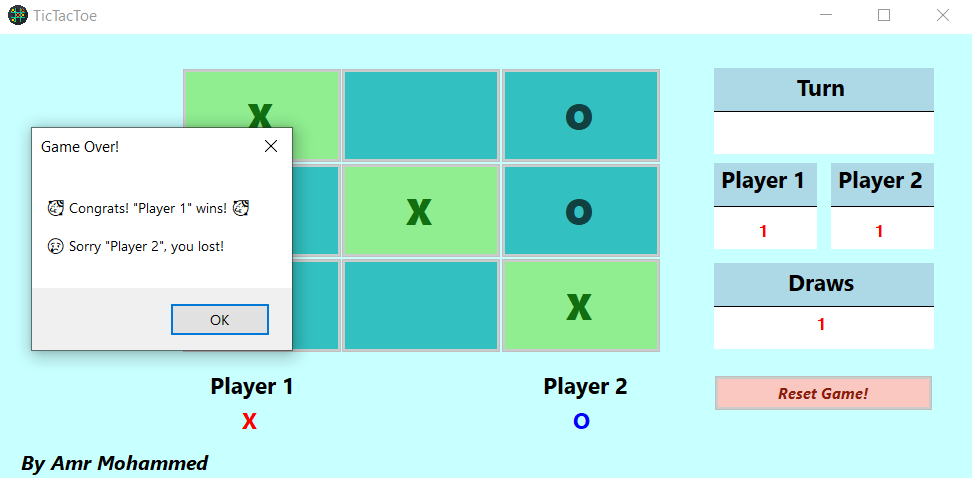
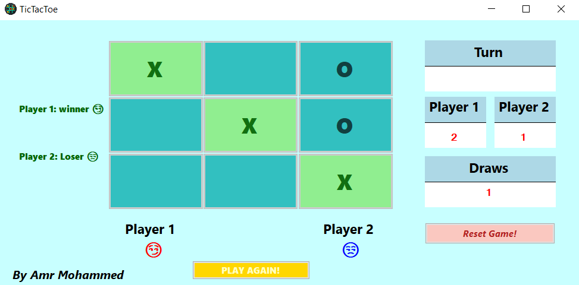

# Ready For Battle - Tic-Tac-Toe ⚔️

## Description
This is a **Tic-Tac-Toe** game developed using **C# and Windows Forms**. following Object-Oriented Programming (OOP) principles for better structure and maintainability. It provides a simple yet interactive gaming experience for two players, designed to enhance strategic thinking and provide a fun challenge! 🏆

## Features
- 🎮 **Player vs. Player (PvP) mode** for competitive fun.
- 🏆 **Automatic winner detection** with a game-over screen.
- 🔄 **Restart the game** without closing the application.
- 🎨 **Simple and intuitive UI** for easy gameplay.
- 📜 **Game history tracking** to keep records of past matches.
- ⏳ **Turn-based system** – Displays whose turn it is dynamically.
- ✨ **Animated winning sequence** – Highlights the winning row.
- 🖱️ **User-friendly controls** – Click-based interaction with a clean UI.

## How to Run the Game 🚀
1. Clone the repository:
   ```bash
   git clone https://github.com/El-fnan/TicTacToe-Form.git
   ```
2. Open the project in **Visual Studio**.
3. Open `TicTacToe.sln`.
4. Click **Start** and enjoy playing! 🎉

## Here are some previews of the game:  

### 🏆 Game Start  
  

### 🎮 In-Game  
  

### 🏁 Game Over  
  
*A message box announcing the winner and loser.*  

  
*The updated board showing the final game state and scores.*  

## Technologies Used 🛠️
- 🖥 **C#** - The main programming language.
- 🏗 **Windows Forms** - For graphical user interface (GUI).
- **Object-Oriented Programming (OOP):**  
  - **Encapsulation** – Separated game logic from UI  
  - **Abstraction** – `GameLogic.cs` manages the game independently  
  - **Reusability** – The game logic is modular and extendable  
- 🎨 **GDI+** - For rendering game visuals.

## Upcoming Features 🔮
- 🤖 **AI-powered single-player mode**.
- 🎵 **Sound effects for a better gaming experience**.
- 🎨 **Customizable themes and skins**.
- 🌍 **Multiplayer Online Mode** – Play against friends over the internet.
 
## About the Developer 👨‍💻
- 💻 **Amr Mohammed** | [GitHub](https://github.com/El-fnan)

## Support the Project ❤️
If you like this project, please consider giving it a ⭐ on GitHub! 🚀